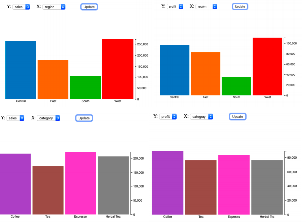
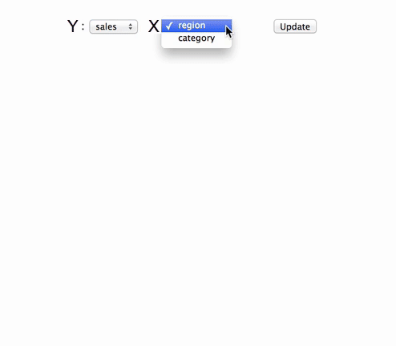

# Coffee Visualization

  

## Visualization

An **interactive** bar chart visualization analyzing the sale and profit of drink (Coffee, Tea) according to the region/category. 

The visualization consists of two drop downs and an update button. 

Once the user chooses an attribute to show on the x-axis, say profit, and for the y-axis, say region, clicking on the update button should show a bar chart with accumulated sum of profits over the different regions.

- Data processing: generate the 4 sets of summation stats directly in JavaScript using d3.

- Add animated transitions to the bars and axis whenever the Y axis data is updated. 

## Dataset

- [Coffee/Tea](data/CoffeeData.csv)

## Instruction

1. Make sure you have `python3` installed
2. Clone this repository by typing this on your terminal or command line `git clone https://github.com/kellypham/Coffee-Visualization.git`
3. Move into the directory `cd Coffee-Visualization`
4. Run the application `python3 -m http.server 8080`
5. Open your browser and go to `http://localhost:8080/`

Note: recommended browser is **Google Chrome**

## Demo

  

## Author
- Kelly Pham
